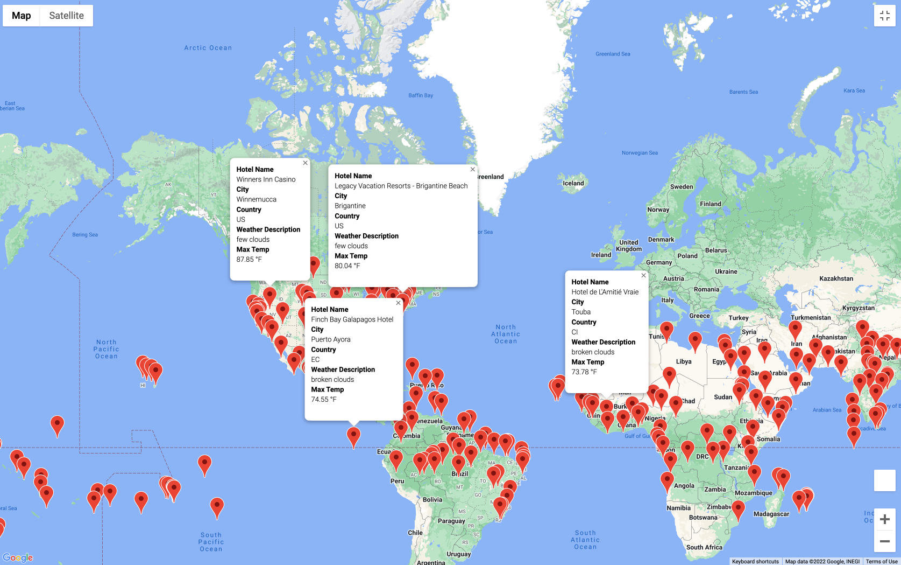
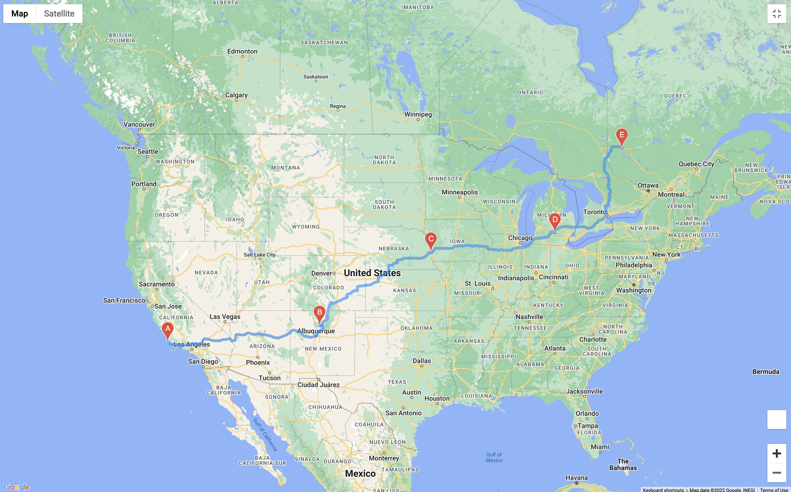

# World_Weather_Analysis

## Overview
The goal of this project is to help users to embrace their inner adventure seeker by randomly selecting location around the world and matching them with their ideal climate range for a fun road trip. 

The analysis and the structure of the directories are divided into 3 main areas weather database, vacation search, and vacation itinerary.
## Resources
### Data sources:
- WeatherPy_Database.csv
- WeatherPy_vacation.csv

### API
- Open Weather 
- Google Map
- Google Directions 
### Dependency Packages
- Pandas
- Random
- citipy
- requests
- gmaps
- numpy 

## Results

## Weather Database - Step 1 
This step uses the Open Weather Map API to pull weather information from all over the world by using the random module to output random numbers as latitude and longitude then use those as coordinatesto match the closet city using citipy module. Then run the cities found thru the Open Weather API to output the following to help users to find ideal vacation spots:

- Maximum Temperature
- Cloudiness
- Wind Speed
- Humidity
- Current Weather Description

## Vacation Search - Step 2 
In this step the information reterived from the weather database output was use as starter information to combined it with Google Maps API to plot different travel destinations with a hotel at each location. In the analysis ran a daily maximum temperature between 70 and 100 degrees farinheit was placed.

## Vacation Itinerary - Step 3
In this step we want to start narrowing down the vacation search to 5 locations and make it into a driving road trip adventure. The Google Directions API was used after the locations were selected. Here is a sample trip below:

